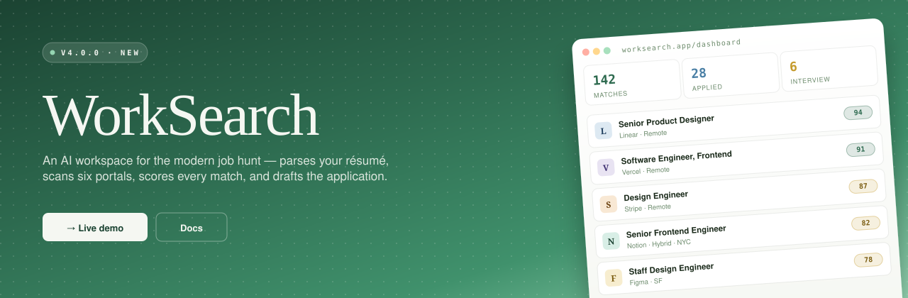

<div align="center">



### *One tab for your entire job hunt. Quiet, dense, and AI-powered where it counts.*

<br />

[](https://github.com/anuragh/work-search/releases)
[](https://nextjs.org)
[](https://react.dev)
[](https://fastapi.tiangolo.com)
[](https://threejs.org)
[](https://clerk.com)
[](./LICENSE)

<br />

**`6`** &nbsp; portals scanned in parallel &nbsp; · &nbsp; **`5`** &nbsp; match-scoring dimensions &nbsp; · &nbsp; **`<30s`** &nbsp; résumé → ranked list &nbsp; · &nbsp; **`100%`** &nbsp; free to start

[**→ Live demo**](https://worksearch.app) &nbsp; · &nbsp; [Docs](./docs) &nbsp; · &nbsp; [Report a bug](https://github.com/anuragh/work-search/issues/new)

</div>

<br />

## ✨ &nbsp; What you get

| | Feature | What it does |
| :---: | :--- | :--- |
| **`01`** | **Résumé intake** | PDF or plain text in, structured skills + titles + years out. Under five seconds. |
| **`02`** | **6-portal fan-out** | Greenhouse · Lever · Ashby · LinkedIn · Indeed + 1 more. Concurrent, deduped. |
| **`03`** | **5-dim scoring** | Skills · experience · title · location · sponsorship. Transparent breakdown per job. |
| **`04`** | **Kanban pipeline** | Drag across Discovered → Applied → Interviewing → Offer → Rejected. Persisted. |
| **`05`** | **AI-drafted docs** | Tailored cover letter in ~30s. Résumé rewrite. ATS score before submit. |
| **`06`** | **Globe view** | Three.js globe — roles plotted by location. Filter by remote, visa, or region. |

<br />

## 🏗 &nbsp; Architecture

```
┌─────────────────┐       ┌─────────────────┐       ┌─────────────────┐
│     Client      │  ──▶  │       API       │  ──▶  │     Sources     │
│                 │       │                 │       │                 │
│   Next.js 16    │       │    FastAPI      │       │   6 portals     │
│   React 19      │       │   Python 3.12   │       │   LLM scoring   │
└─────────────────┘       └─────────────────┘       └─────────────────┘

   Vercel · Edge RSC   │   Hugging Face Space · :7860   │   Clerk · Anthropic · Redis
```

<br />

## 🚀 &nbsp; Quick start

You'll need [`pnpm`](https://pnpm.io), [`Python 3.12`](https://www.python.org), a [Clerk](https://clerk.com) publishable + secret key, and an [Anthropic](https://console.anthropic.com) API key.

**1. Clone the repo**

```bash
git clone https://github.com/anuragh/work-search.git
cd work-search
```

**2. Run the frontend** (→ http://localhost:3000)

```bash
cd frontend
pnpm install
cp .env.example .env.local       # add CLERK_* keys
pnpm dev
```

**3. Run the backend** (→ http://localhost:7860)

```bash
cd backend
python -m venv venv && source venv/bin/activate
pip install -r requirements.txt
cp .env.example .env             # add ANTHROPIC_API_KEY
uvicorn main:app --reload
```

<br />

## 📦 &nbsp; Stack

| Layer       | Tech                                                                            |
| :---------- | :------------------------------------------------------------------------------ |
| Frontend    | `Next.js 16` · `React 19` · `Tailwind 4` · `Zustand` · `Radix UI`               |
| 3D          | `three.js` · `react-three-fiber` · `drei`                                       |
| Auth        | `Clerk`                                                                         |
| Backend     | `FastAPI` · `Python 3.12` · `httpx` · `uvicorn`                                 |
| AI          | `Anthropic Claude` · `OpenAI` · `Redis` embedding cache                         |
| Deploy      | `Vercel` · `Hugging Face Spaces`                                                |

<br />

## 🗺 &nbsp; Roadmap

- **Shipped** — Pipeline kanban, AI cover letters, globe view, 5-dim scoring
- **Next up** — Chrome extension to apply from any portal
- **Later** — Outreach drafts (warm intros from your network), salary intelligence overlay

<br />

## 🤝 &nbsp; Contributing

Issues and PRs welcome. Run `pnpm lint` before pushing.

Want to add a new job portal? Each scraper lives in `backend/services/portals/` and yields a stream of normalized `JobListing` records.

<br />

## 📄 &nbsp; License

MIT © 2026 Anuragh. See [LICENSE](./LICENSE).

<br />

---

<div align="center">

<sub>Built by <a href="https://github.com/anuragh"><b>Anuragh</b></a> &nbsp; · &nbsp; <a href="https://worksearch.app">worksearch.app</a> &nbsp; · &nbsp; <a href="https://twitter.com/anuragh">@anuragh</a></sub>

</div>
